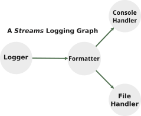

# *Streams* Logger

Streams is a type-safe logger for TypeScript and Node.js applications.

## Introduction



*Streams* is an intuitive type-safe logging facility built on native Node.js streams.  You can use the built-in logging components (e.g., the [Logger](#the-logger-class), [Formatter](#the-formatter-class), [Filter](#the-filter-class), [ConsoleHandler](#the-consolehandler-class), [RotatingFileHandler](#the-rotatingfilehandler-class), and [SocketHandler](#the-sockethandler-class)) for [common logging tasks](#usage) or implement your own logging [Node](https://github.com/faranalytics/@farar/nodes) to handle a wide range of logging scenarios. *Streams* offers a graph-like API pattern for building sophisticated logging pipelines.

### Features

- A library of commonly used logging components: [Logger](#the-logger-class), [Formatter](#the-formatter-class), [Filter](#the-filter-class), [ConsoleHandler](#the-consolehandler-class), [RotatingFileHandler](#the-rotatingfilehandler-class), and [SocketHandler](#the-sockethandler-class).
- A rich selection of [contextual data](#the-logrecord-class) (e.g., module name, function name, line number, etc.) for augmenting log messages.
- A type-safe graph-like API pattern for constructing sophisticated [logging graphs](#graph-api-pattern).
- Consume any native Node.js Readable, Writable, Duplex, or Transform stream and add it to your graph.
- Error propagation and selective termination of inoperable graph components.
- Import *Streams* into your Node.js project or take advantage of the TypeScript type definitions. 

## Table of Contents

- [Installation](#installation)
- [Concepts](#concepts)
- [Usage](#usage)
    - [Log to the Console and a File](#log-to-the-console-and-to-a-file)
- [Examples](#examples)
    - [*An Instance of Logging "Hello, World!"*](#an-instance-of-logging-hello-world-example)
    - [*A Network Connected **Streams** Logging Graph*](#a-network-connected-streams-logging-graph-example)
- [API](#api)
    - [The Logger Class](#the-logger-class)
    - [The Formatter Class](#the-formatter-class)
    - [The Filter Class](#the-filter-class)
    - [The ConsoleHandler Class](#the-consolehandler-class)
    - [The RotatingFileHandler Class](#the-rotatingfilehandler-class)
    - [The SocketHandler Class](#the-sockethandler-class)
    - [The LogRecord Class](#the-logrecord-class)
    - [The Streams Config Settings Object](#the-streams-config-settings-object)
- [Formatting](#formatting)
    - [Example Serializer](#example-serializer)
- [Using a Socket Handler](#using-a-socket-handler)
- [Hierarchical Logging](#hierarchical-logging)
- [How-Tos](#how-tos)
    - [How to implement a custom *Streams* data transformation Node.](#how-to-implement-a-custom-streams-data-transformation-node)
    - [How to consume a Readable, Writable, Duplex, or Transform stream.](#how-to-consume-a-readable-writable-duplex-or-transform-nodejs-stream)
- [Tuning](#tuning)
    - [Tune the highWaterMark.](#tune-the-highwatermark)
    - [Disable the stack trace capture.](#disable-the-stack-trace-capture)
    - [Disconnect from root.](#disconnect-from-root)
- [Backpressure](#backpressure)

## Installation

```bash
npm install streams-logger
```

## Concepts

### Data Transformation Node

Logging is essentially a data transformation task.  When a string is logged to the console, for example, it typically undergoes a transformation step where relevant information (e.g., the timestamp, log level, process id, etc.) is added to the log message prior to it being printed.  Each data transformation step in a *Streams* logging graph is realized through a `Node` implementation.  Each `Node` in a data transformation graph consumes an input, transforms or filters the data in some way, and optionally produces an output. Each component (e.g., Loggers, Formatters, Filters, Handlers, etc.) in a *Streams* logging graph *is a* `Node`.

### Graph API Pattern

*Streams* uses a [graph-like API pattern](#connect-the-logger-to-the-formatter-and-connect-the-formatter-to-the-consolehandler-and-rotatingfilehandler) for constructing a logging graph. Each graph consists of a network of `Node` instances that together comprise a graph logging pipeline.

## Usage

In this hypothetical example you will log "Hello, World!" to the console and to a file.

### Log to the Console and to a File

#### 1. Import the Logger, Formatter, ConsoleHandler and RotatingFileHandler, and SyslogLevel enum.

```ts
import { Logger, Formatter, ConsoleHandler, RotatingFileHandler, SyslogLevel } from 'streams-logger';
```

#### 2. Create an instance of a Logger, Formatter, ConsoleHandler and RotatingFileHandler.

- The `Logger` is set to log at level `SyslogLevel.DEBUG`.  
- The `Formatter` constructor is passed a `format` function that will serialize data contained in the `LogRecord` to a string containing the ISO time, the log level, the function name, the line number, the column number, and the log message.
- The `ConsoleHandler` will log the message to `process.stdout`.
- The `RotatingFileHandler` will log the message to the file `./message.log`.

```ts
const logger = new Logger({ level: SyslogLevel.DEBUG });
const formatter = new Formatter({
    format: async ({ isotime, message, name, level, func, url, line, col }) => (
        `${isotime}:${level}:${func}:${line}:${col}:${message}\n`
    )
});
const consoleHandler = new ConsoleHandler({ level: SyslogLevel.DEBUG });
const rotatingFileHandler = new RotatingFileHandler({ path: './message.log', level: SyslogLevel.DEBUG });
```

#### 3. Connect the Logger to the Formatter and connect the Formatter to the ConsoleHandler and RotatingFileHandler.
*Streams* uses a graph-like API pattern in order to construct a network of log Transforms.  Each component in a given network, in this case the `Logger`, the `Formatter`, and the `ConsoleHandler` and `RotatingFileHandler`, is a [Transform](https://github.com/faranalytics/@farar/nodes).
```ts
const log = logger.connect(
    formatter.connect(
        consoleHandler,
        rotatingFileHandler
    )
);
```

#### 4. Log "Hello, World!" to the console and to the file `./message.log`.

```ts
function sayHello() {
    log.info('Hello, World!');
}

sayHello();
```

##### Output:
```bash
# ⮶date-time    function name⮷   column⮷ ⮶message
2024-06-12T00:10:15.894Z:INFO:sayHello:7:9:Hello, World!
#                        ⮴level       ⮴line number
```
## Examples

### *An Instance of Logging "Hello, World!"* <sup><sup>(example)</sup></sup>
Please see the [Usage](#usage) section above or the ["Hello, World!"](https://github.com/faranalytics/streams-logger/tree/main/examples/hello_world) example for a working implementation.

### *A Network Connected **Streams** Logging Graph* <sup><sup>(example)</sup></sup>
Please see the [*Network Connected **Streams** Logging Graph*](https://github.com/faranalytics/streams-logger/tree/main/examples/network_connected_logging_graph) example that demonstrates how to connect *Streams* logging graphs over the network.

## API

The *Streams* API provides commonly used logging facilities (i.e., the [Logger](#the-logger-class), [Formatter](#the-formatter-class), [ConsoleHandler](#the-consolehandler-class), [RotatingFileHandler](#the-rotatingfilehandler-class), and [SocketHandler](#the-sockethandler-class)).  However, you can [consume any Node.js stream](#how-to-consume-a-readable-writable-duplex-or-transform-nodejs-stream) and add it to your logging graph.

### The Logger Class

**new streams-logger.Logger(options, streamOptions)**
- options `<LoggerOptions>`
    - level `<SyslogLevel>` The syslog compliant logger level.
    - name `<string>` An optional name for the `Logger`.
    - parent `<Logger>` An optional parent `Logger`.  **Default:** `streams-logger.root`
    - queueSizeLimit `<number>` Optionally specify a limit on how large (i.e., the number of logged messages) the message queue may grow while waiting for a stream to drain.
    - captureStackTrace `<boolean>` Optionally specify if stack trace capturing is enabled.  This setting can be overriden by the *Streams* configuration setting `Config.captureStackTrace`. **Default:** `true`
- streamOptions `<stream.TransformOptions>` Optional options to be passed to the stream.

Use an instance of a Logger to propagate messages at the specified syslog level.

*public* **logger.level**
- `<SyslogLevel>`

The configured log level (e.g., `SyslogLevel.DEBUG`).

*public* **logger.connect(...transforms)**
- transforms `<Array<Transform<LogRecord<string, SyslogLevelT>, unknown>>`  Connect to an Array of `Transforms`.

Returns: `<Logger<LogRecord<string, SyslogLevelT>, LogRecord<string, SyslogLevelT>>`

*public* **logger.disconnect(...transforms)**
- transforms `<Array<Transform<LogRecord<string, SyslogLevelT>, unknown>>` Disconnect from an Array of `Transforms`.

Returns: `<Logger<LogRecord<string, SyslogLevelT>, LogRecord<string, SyslogLevelT>>`

*public* **logger.debug(message)**
- message `<string>` Write a DEBUG message to the `Logger`.

Returns: `<void>`

*public* **logger.info(message)**
- message `<string>` Write a INFO message to the `Logger`.

Returns: `<void>`

*public* **logger.notice(message)**
- message `<string>` Write a NOTICE message to the `Logger`.

Returns: `<void>`

*public* **logger.warn(message)**
- message `<string>` Write a WARN message to the `Logger`.

Returns: `<void>`

*public* **logger.error(message)**
- message `<string>` Write a ERROR message to the `Logger`.

Returns: `<void>`

*public* **logger.crit(message)**
- message `<string>` Write a CRIT message to the `Logger`.

Returns: `<void>`

*public* **logger.alert(message)**
- message `<string>` Write a ALERT message to the `Logger`.

Returns: `<void>`

*public* **logger.emerg(message)**
- message `<string>` Write a EMERG message to the `Logger`.

Returns: `<void>`

*public* **logger.setLevel(level)**
- level `<SyslogLevel>` A log level.

Set the log level.  Must be one of `SyslogLevel`.

### The Formatter Class

**new streams-logger.Formatter(options, streamOptions)**
- options
    - format `(record: LogRecord<string, SyslogLevelT>): Promise<string> | string` A function that will format and serialize the `LogRecord<string, SyslogLevelT>`.  Please see [Formatting](#formatting) for how to implement a serializer.
- streamOptions `<stream.TransformOptions>` Optional options to be passed to the stream.

Use a `Formatter` in order to specify how your log message will be formatted prior to forwarding it to the Handler(s).  An instance of [`LogRecord`](#the-logrecord-class) is created that contains information about the environment at the time of the logging call.  The `LogRecord` is passed as the single argument to serializer function.

### The Filter Class

**new streams-logger.Filter(options, streamOptions)**
- options
    - filter `(record: LogRecord<string, SyslogLevelT>): Promise<boolean> | boolean` A function that will filter the `LogRecord<string, SyslogLevelT>`.  Return `true` in order to permit the message through; otherwise, return `false`.
- streamOptions `<stream.TransformOptions>` Optional options to be passed to the stream.

### The ConsoleHandler Class

**new streams-logger.ConsoleHandler(options, streamOptions)**

- options `<ConsoleHandlerTransformOtions>`
    - level `<SyslogLevel>` An optional log level.  **Default**: `SyslogLevel.WARN`
- streamOptions `<stream.TransformOptions>` Optional options to be passed to the stream.

Use a `ConsoleHandler` in order to stream your messages to the console.

*public* **consoleHandler.setLevel(level)**
- level `<SyslogLevel>` A log level.

Set the log level.  Must be one of `SyslogLevel`.

### The RotatingFileHandler Class

**new streams-logger.RotatingFileHandler(options, streamOptions)**
- options `<RotatingFileHandlerOptions>`
    - path `<string>` 
    - rotations `<0 | 1 | 2 | 3 | 4 | 5 | 6 | 7 | 8 | 9 | 10>` An optional number of log rotations.
    - bytes `<number>` The size of the log file in MB. **Default**: `1e6`
    - encoding `<BufferEncoding>` An optional encoding. **Default**: `utf8`
    - mode `<number>` An optional mode. **Deafult**:`0o666`
    - level `<SyslogLevel>` An optional log level.  **Default**: `SyslogLevel.WARN`
- streamOptions `<stream.TransformOptions>` Optional options to be passed to the stream.

Use a `RotatingFileHandler` in order to write your log messages to a file.

*public* **rotatingFileHandler.setLevel(level)**
- level `<SyslogLevel>` A log level.

Set the log level.  Must be one of `SyslogLevel`.

### The SocketHandler Class

**new streams-logger.SocketHandler(options, streamOptions)**
- options `<SocketHandlerOptions>`
    - socket `<Socket>` 
    - reviver `<(this: unknown, key: string, value: unknown) => unknown>` An optional reviver for `JSON.parse`.
    - replacer `<(this: unknown, key: string, value: unknown) => unknown>` An optional replacer for `JSON.stringify`.
    - space `<string | number>` An optional space specification for `JSON.stringify`. 
- streamOptions `<stream.DuplexOptions>` Optional options to be passed to the stream.

Use a `SocketHandler` in order to connect *Stream* graphs over the network.  Please see the [*A Network Connected **Streams** Logging Graph*](#a-network-connected-streams-logging-graph-example) example for instructions on how to use a `SocketHandler` in order to connect *Streams* logging graphs over the network.

### The LogRecord Class

**new streams-logger.LogRecord(options)**
- options `<LoggerOptions>`
    - message `<string>` The logged message.
    - name `<string>` The name of the `Logger`.
    - level `<KeysUppercase<LevelT>` An uppercase string representing the log level.
    - depth `<number>` Used to specify which line of the stack trace to parse.
    - stack `<string>` An optional stack trace.

A `LogRecord` is instantiated each time a message is logged at (or below) the level set on the `Logger`. It contains information about the process and environment at the time of the logging call.  All *Streams* Transforms take a `LogRecord` as an input and emit a `LogRecord` as an output.  

The `LogRecord` is passed as the single argument to the [format function](#formatting) of the `Formatter`; information about the environment can be extracted from the `LogRecord` in order to format the logged message.  The following properties will be available to the `format` functioning depending on the setting of `Config.captureStackTrace`.

*public* **logRecord.message**
- `<string>`
The logged message.

*public* **logRecord.name**
- `<string>`
The name of the `Logger`.

*public* **logRecord.level**
- `<DEBUG | INFO | NOTICE | WARN | ERROR | CRIT | ALERT | EMERG>`
An uppercase string representation of the level.

*public* **logRecord.func**
- `<string>`
The name of the function where the logging call took place.  Available if `Config.captureStackTrace` is set to `true`.

*public* **logRecord.line**
- `<string>`
The line number of the logging call.  Available if `Config.captureStackTrace` is set to `true`.

*public* **logRecord.col**
- `<string>`
The column of the logging call.  Available if `Config.captureStackTrace` is set to `true`.

*public* **logRecord.isotime**
- `<string>`
The date and time in ISO format at the time of the logging call.

*public* **logRecord.pathname**
- `<string>`
The name of the module.  Available if `Config.captureStackTrace` is set to `true`.

*public* **logRecord.path**
- `<string>`
The complete path of the module.  Available if `Config.captureStackTrace` is set to `true`.

*public* **logRecord.pathdir**
- `<string>`
The directory part of the path.  Available if `Config.captureStackTrace` is set to `true`.

*public* **logRecord.pathroot**
- `<string>`
The root of the path.  Available if `Config.captureStackTrace` is set to `true`.

*public* **logRecord.pathbase**
- `<string>`
The module filename.  Available if `Config.captureStackTrace` is set to `true`.

*public* **logRecord.pathext**
- `<string>`
The extension of the module.  Available if `Config.captureStackTrace` is set to `true`.

*public* **logRecord.pid**
- `<string>`
The process identifier.

*public* **logRecord.env**
- `<NodeJS.ProcessEnv>`
The process environment.

*public* **logRecord.threadid**
- `<string>`
The thread identifier.

### The Streams Config Settings Object

**Config.setDefaultHighWaterMark(objectMode, value)**
- objectMode `<boolean>` `true` if setting the ObjectMode `highWaterMark`; `false`, otherwise.
- value `number` The `highWaterMark` value.

Returns: `<void>`

**Config.getDefaultHighWaterMark(objectMode)**
- objectMode `<boolean>` `true` if getting the ObjectMode `highWaterMark`; `false`, otherwise.

Returns: `<number>` The default `highWaterMark`.

**Config.setCaptureStackTrace(value)**
- value `<boolean>` Set this to `true` in order to capture a stack trace on each logging call.  Default: `true`

Returns: `<void>`

**Config.getDuplexDefaults(writableObjectMode, readableObjectMode)**
- writableObjectMode `<boolean>` `true` for ObjectMode; `false` otherwise.
- readableObjectMode `<boolean>` `true` for ObjectMode; `false` otherwise.

Returns: `<stream.DuplexOptions>`

Use `Config.getDuplexDefaults` when implementing a [custom *Streams* Transform](#how-to-implement-a-custom-streams-transform).

**Config.getWritableDefaults(writableObjectMode)**
- writableObjectMode `<boolean>` `true` for ObjectMode; `false` otherwise.

Returns: `<stream.WritableOptions>`

Use `Config.getWritableDefaults` when implementing a [custom *Streams* Transform](#how-to-implement-a-custom-streams-transform).

**Config.getReadableDefaults(readableObjectMode)**
- readableObjectMode `<boolean>` `true` for ObjectMode; `false` otherwise.

Returns: `<stream.ReadableOptions>`

Use `Config.getReadableDefaults` when implementing a [custom *Streams* Transform](#how-to-implement-a-custom-streams-transform).

## Formatting

The `Logger` constructs and emits a `LogRecord<string, SyslogLevelT>` on each logged message.  At some point in a logging graph the properties of a `LogRecord` *may* undergo formatting and serialization.  This can be accomplished by passing a `FormatterOptions` object, to the constructor of a `Formatter`, with its `format` property set to a custom [serialization function](#example-serializer) that accepts a `LogRecord` as its single argument.  The serialization function can construct a log message from the `LogRecord` [properties](#the-logrecord-class).  In the concise example below this is accomplished by using a [template literal](https://developer.mozilla.org/en-US/docs/Web/JavaScript/Reference/Template_literals).

### Example Serializer

In the following code excerpt, a serializer is implemented that logs:

1. The current time
2. The log level
3. The name of the function where the log event originated
4. The line number of the logging event
5. The column number of the logging event
6. The log message
7. A newline

The `format` function is passed to the constructor of a `Formatter`, which will serialize the data contained in the `LogRecord` to a string.  The `Logger` is connected to the `Formatter`.  The `Formatter` is connected to the `ConsoleHandler`.

```ts

const logger = new Logger({ name: 'main', level: SyslogLevel.DEBUG });
const formatter = new Formatter({
    format: async ({ isotime, message, name, level, func, url, line, col }) => (
        `${isotime}:${level}:${func}:${line}:${col}:${message}\n`
    )
});
const consoleHandler = new ConsoleHandler();

const log = logger.connect(
    formatter.connect(
        consoleHandler
    )
)

log.info('Hello, World!');
```

This is an example of what a logged message will look like using the serializer defined above.

```bash
# ⮶date-time    function name⮷   column⮷ ⮶message
2024-06-12T00:10:15.894Z:INFO:sayHello:7:9:Hello, World!
#                        ⮴level       ⮴line number
```
## Using a Socket Handler

*Streams* uses Node.js streams for message propagation.  Node.js represents sockets as streams; hence, sockets are a natural extension of a *Streams* logging graph.  For example, you may choose to use a `ConsoleHandler` locally and log to a `RotatingFileHandler` on a remote server.  Please see the [*A Network Connected **Streams** Logging Graph*](#a-network-connected-streams-logging-graph-example) example for a working implementation.

### Security

The `SocketHandler` options take a socket instance as an argument.  The `net.Server` that produces this socket may be configured however you choose.  You can encrypt the data sent over TCP connections and authenticate clients by configuring your `net.Server` accordingly.

#### Configure your server to use TLS encryption.
TLS Encryption may be implemented using native Node.js [TLS Encryption](https://nodejs.org/docs/latest-v20.x/api/tls.html).

#### Configure your client to use TLS client certificate authentication.
TLS Client Certificate Authentication may be implemented using native Node.js [TLS Client Authentication](https://nodejs.org/docs/latest-v20.x/api/tls.html).

## Hierarchical Logging

*Streams* supports hierarchical logging.  By default every `Logger` instance is connected to the root `Logger` (`streams-logger.root`).  However, you may optionally specify an antecedent other than `root` by assigning an instance of `Logger` to the `parent` property in the `LoggerOptions`.  The antecedent of the root `Logger` is `null`.

You may capture logging events from other modules (*and your own*) by connecting a data handler `Node` (e.g., a `ConsoleHandler`) to the `streams-logger.root` `Logger`. E.g.,

```ts
import * as streams from 'streams-logger';

const formatter = new Formatter({
    format: async ({ isotime, message, name, level, func, url, line, col }) => (
        `${isotime}:${level}:${func}:${line}:${col}:${message}\n`
    )
});
const consoleHandler = new streams.ConsoleHandler({ level: streams.SyslogLevel.DEBUG });

streams.root.connect(
    formatter.connect(
        consoleHandler
    )
);
```

## How-Tos

### How to implement a custom *Streams* data transformation Node.

*Streams* is built on the type-safe Nodes graph API framework.  This means that any Nodes `Node` may be incorporated into your logging graph given that it meets the contextual type requirements.  In order to implement a *Streams* data transformation `Node`, subclass the `Node` class, and provide the appropriate *Streams* defaults to the stream constructor.

For example, the somewhat contrived `LogRecordToBuffer` implementation transforms the `message` contained in a `LogRecord` to a `Buffer`; the graph pipeline streams the message to `process.stdout`.

> NB: `writableObjectMode` is set to `true` and `readableObjectMode` is set to `false`; hence, the Node.js stream implementation will handle the input as a `object` and the output as an `Buffer`. It's important that `writableObjectMode` and `readableObjectMode` accurately reflect the input and output types of your Transform.

```ts
import * as stream from 'node:stream';
import { Logger, Node, Config, LogRecord, SyslogLevelT } from 'streams-logger';

export class LogRecordToBuffer extends Node<LogRecord<string, SyslogLevelT>, Buffer> {

    public encoding: NodeJS.BufferEncoding = 'utf-8';

    constructor(streamOptions?: stream.TransformOptions) {
        super(new stream.Transform({
            ...Config.getDuplexDefaults(true, false),
            ...streamOptions,
            ...{
                writableObjectMode: true,
                readableObjectMode: false,
                transform: (chunk: LogRecord<string, SyslogLevelT>, encoding: BufferEncoding, callback: stream.TransformCallback) => {
                    callback(null, Buffer.from(chunk.message, this.encoding));
                }
            }
        })
        );
    }
}

const log = new Logger();
const messageToHex = new LogRecordToBuffer();
const console = new Node<Buffer, never>(process.stdout)

log.connect(
    messageToHex.connect(
        console
    )
);

log.warn('Hello, World!\n');
```
#### Output
```bash
Hello, World!
```

### How to consume a Readable, Writable, Duplex, or Transform Node.js stream.

You can incorporate any Readable, Writable, Duplex, or Transform stream into your logging graph, given that it meets the contextual type requirements, by passing the stream to the `Node` constructor.  In this hypothetical example a type-safe `Node` is constructed from a `net.Socket`.  The type variables are specified as `<Buffer, Buffer>`; the writable side of the stream consumes a `Buffer` and the readable side of the stream produces a `Buffer`. 

```ts
import * as net from 'node:net';
import { once } from 'node:events';
import { Node } from 'streams-logger';

net.createServer((socket: net.Socket) => socket.pipe(socket)).listen(3000);
const socket = net.createConnection({ port: 3000 });
await once(socket, 'connect');
const socketHandler = new Node<Buffer, Buffer>(socket);
```

## Tuning

**Depending on your requirements the defaults may be fine.**  However, for high throughput applications you may choose to adjust the `highWaterMark`, disconnect your `Logger` from the root `Logger`, and/or disable stack trace capturing.

### Tune the `highWaterMark`.

*Streams* `Node` implementations use the native Node.js stream API for message propagation.  You have the option of tuning the Node.js stream `highWaterMark` to your specific needs - keeping in mind memory constraints.  You can set a default `highWaterMark` using `Config.setDefaultHighWaterMark(objectMode, value)` that will apply to Nodes in the *Streams* library.  Alternatively, you can pass an optional stream configuration argument to each `Transform` individually.

In this example, the `highWaterMark` of ObjectMode streams and Buffer streams is artificially set to `1e6` objects and `1e6` bytes.

```ts
import * as streams from 'streams-logger';

streams.Config.setDefaultHighWaterMark(true, 1e6);
streams.Config.setDefaultHighWaterMark(false, 1e6);
```

### Disable the stack trace capture.

Another optional setting that you can take advantage of is to turn off the stack trace capture.  Stack trace capture can be disabled globally using the *Streams* configuration settings object.  Alternatively, you may turn off stach trace capture in a specific `Logger` by setting the `stackTraceCapture` property of the `LoggerOptions` to `false`. 

Turning off stack trace capture will disable some of the information (e.g., function name and line number) that is normally contained in the `LogRecord` object that is passed to the `format` function of a `Formatter`.

```ts
import * as streams from 'streams-logger';

streams.Config.setCaptureStackTrace(false);
```

### Disconnect from root.

You can optionally disconnect your `Logger` from the root `Logger` or a specified antecedent.  This will prevent message propagation to the root logger, which will provide cost savings and isolation.  E.g.,

```ts
import * as streams from 'streams-logger';
...
const log = logger.connect(
    formatter.connect(
        consoleHandler
    )
);
log.disconnect(streams.root);
```

## Backpressure
*Streams* respects backpressure by queueing messages while the stream is draining.  You can set a limit on how large the message queue may grow by specifying a `queueSizeLimit` in the Logger constructor options.  If a `queueSizeLimit` is specified and if it is exceeded, the `Logger` will throw a `QueueSizeLimitExceededError`.  

**For typical logging applications setting a `queueSizeLimit` isn't necessary.**  However, if a stream peer reads data at a rate that is slower than the rate that data is written to the stream, data may buffer until memory is exhausted.  By setting a `queueSizeLimit` you can effectively respond to subversive stream peers and disconnect offending @farar/nodes in your graph.

If you have a *cooperating* stream that is backpressuring, you can either set a default `highWaterMark` appropriate to your application or increase the `highWaterMark` on the specific stream in order to mitigate drain events.
